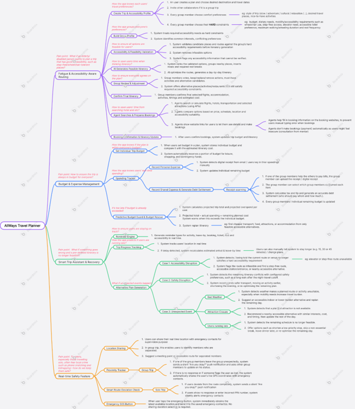
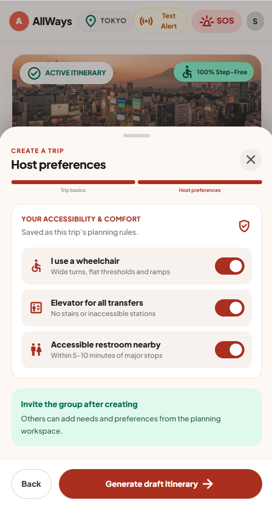
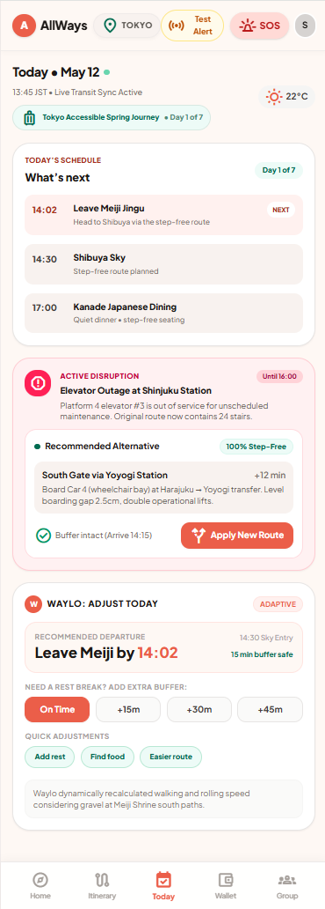
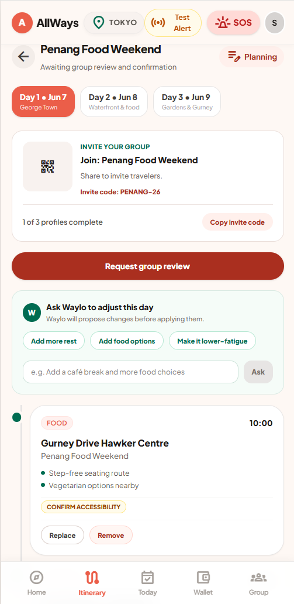
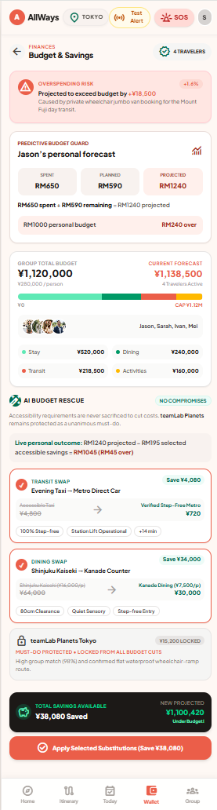
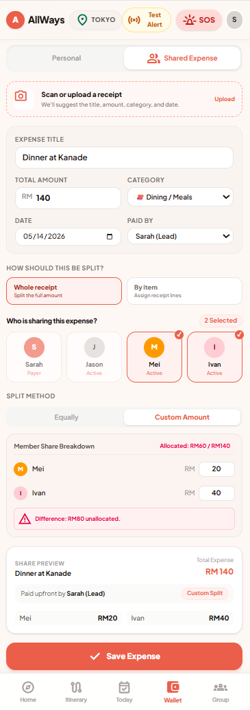
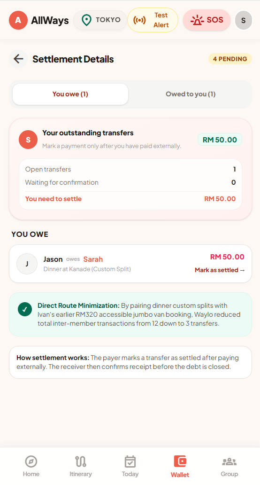
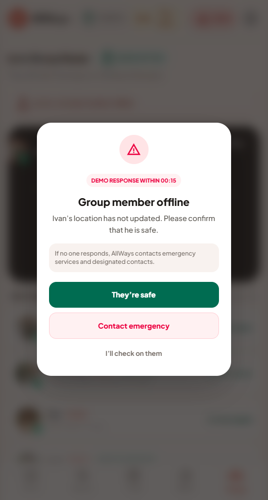
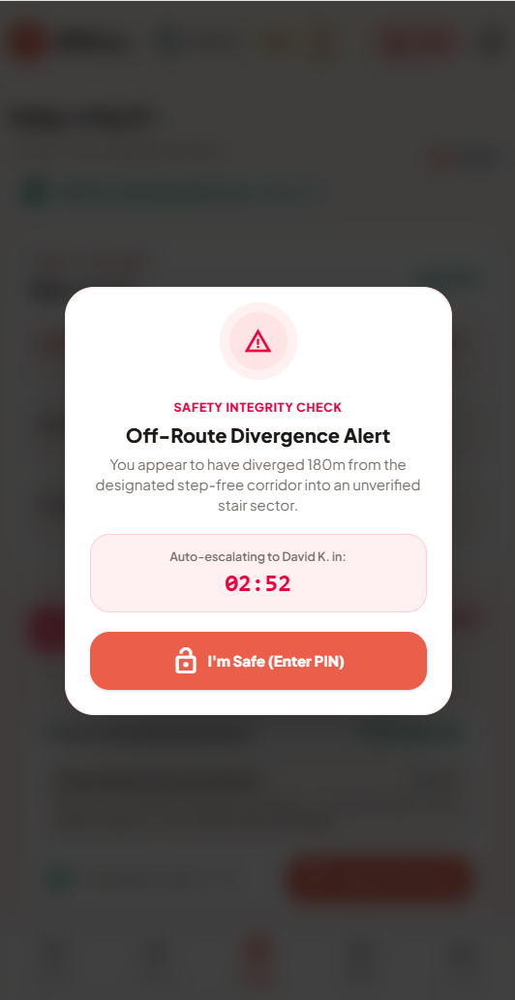

# AllWays: Accessible Group Travel Planner

**Team: Make Things Work** — Tan Yik Yang, Pat Yoon Xin, Lim Pei En, Jasmine Chin Jia Yee

**Problem Statement:** Travel Planner

- 🎥 **Video Presentation:** [Watch on YouTube](https://youtu.be/3VEqc3Pg-Dg)
- 🖼️ **Presentation Slides:** [View on Canva](https://canva.link/kxj3nuiawmub8sa)
- 🚀 **Prototype:** [Open Live Demo](https://all-ways-two.vercel.app/)

---

## Table of Contents

1. [Project Overview](#1-project-overview)
2. [Ideation & Process](#2-ideation--process)
3. [Design & Prototype](#3-design--prototype)
4. [What Makes It Different](#4-what-makes-it-different)
5. [Technical Architecture & Feasibility](#5-technical-architecture--feasibility)
6. [Getting Started](#6-getting-started)

---

## 1. Project Overview

### 1.1 What the project is about

AllWays is an inclusive, AI-powered group travel ecosystem that seamlessly synchronizes itineraries, manages shared finances, and ensures real-time safety. Unlike traditional travel apps, AllWays treats physical accessibility and user fatigue as non-negotiable baseline constraints, dynamically adjusting plans so every member of a group can travel comfortably.

### 1.2 Background & Context (The Problem)

Planning group trips typically requires juggling multiple fragmented apps for bookings, budgets, and itineraries, which causes immense stress when unexpected delays occur. This friction is exponentially worse for groups traveling with elderly members or individuals with disabilities. Existing market solutions completely ignore hidden constraints like stamina limits or the need for step-free routes. Consequently, coordinating accessible paths, tracking group fatigue, or finding safe regrouping points mid-trip becomes a logistical nightmare that current platforms fail to solve.

### 1.3 Core Project Features

- **Fatigue & Accessibility-Aware Routing** — AI generates optimized itineraries that automatically integrate rest stops, map step-free paths, and adjust travel pacing based on the group's predefined physical limits.
- **Real-Time Safety Sync & Smart Regrouping** — Live GPS tracking monitors group proximity and dynamically suggests accessible, step-free meeting points if members separate or fall behind. For solo travelers, the Smart Route-Deviation Check monitors their planned route and detects unexpected deviations, prompting a discreet safety check and alerting emergency contacts when necessary.
- **Smart Debt Optimization** — A contextual expense ledger automatically calculates complex multi-person splits and generates precise debt settlements with one-tap payment reminders.
- **Real-Time Alternative Plan Generation** — Adapts itineraries in real time to keep schedules flexible and feasible when unexpected delays, accessibility failures, safety risks, or closures occur.
- **Dynamic SOS & Ground Truth Logging** — Provides accessibility-aware emergency routing and empowers users to contribute post-trip validation of real-world accessibility infrastructure.

### 1.4 Key Technologies

Developed as an Android application using React Native, the platform leverages a Python (FastAPI) backend to orchestrate complex route optimization via the OpenAI API. Supabase powers real-time PostgreSQL WebSockets for live group tracking and collaborative voting, while the Google Maps Platform handles geographical validation.

---

## 2. Ideation & Process

### 2.1 Ideas We Considered

**Chosen ideas** that form the core product:

| Idea | Explanation |
| --- | --- |
| **User Create Trip & Accessibility Profile** | Users set up a plan with destination and travel dates, invite collaborators, and let each member define soft comfort preferences (travel style, desired places) alongside non-negotiable hard constraints (budget, dietary needs, wheelchair/step-free access, rest frequency). |
| **System Build Group Profile** | The system processes group inputs, treating accessibility needs as strict hard constraints while identifying overlapping interests and conflicting preferences. |
| **Accessibility & Feasibility Validation** | Validates candidate places and routes against hard accessibility requirements, eliminates infeasible options, and flags unverified accessibility data. |
| **AI Generates Feasible Itinerary** | AI ranks validated options, clusters nearby places, and optimizes routes into a day-by-day travel plan. |
| **Group Review & Voting & Adjustment** | Members review the plan to vote, swap, or remove activities, with compliant alternatives offered whenever changes are made. |
| **Agent Searches & Prepares Bookings** | AI agents compare travel options via APIs, pre-fill booking details on external sites to reduce manual errors, and present direct booking links for users to review and pay. |
| **System Set Individual Trip Budget** | Stores individual budgets, compares them against estimated itinerary costs, and reserves portions for leisure, shopping, and contingency funds. |
| **Personal Expense Tracking via Receipt Scanning** | Tracks spending automatically through digital receipts detected from emails or via manual entry, dynamically updating the remaining personal budget. |
| **Record Shared Expense & Debt Settlement** | Users upload receipts for shared costs, select which members consumed specific items, and let the system calculate tax and tip to generate precise settlements. |
| **Predictive Budget Guard & Budget Rescue** | Projects total trip costs, alerts users about overspending risk, and offers an automated itinerary replan. |
| **Real-Time Reminder Engine** | Generates notifications for activities, departure times, booking and ticket details, rest breaks, and accessibility alerts. |
| **Real-Time Trip Progress Tracking** | Tracks locations to recalculate arrival and leave-by times during delays, while allowing manual stay extensions (+15/30/45 mins). |
| **Real-Time Map Direction** | Integrates with map APIs to guide users in real time. |
| **Real-Time Alternative Plan Generation** | Handles accessibility disruptions (broken elevator/blocked step-free path), safety disruptions (late-night walking distances), and unexpected events (bad weather, closures, running late) with instant fixes. |
| **Location Sharing** | Users share real-time locations with emergency contacts and help identify separated members with accessible meeting points. |
| **Group Proximity Tracker** | Detects when a member wanders off, sends a discreet check-in, prompts other members, and broadcasts live GPS to emergency contacts if unresponsive. |
| **Smart Route-Deviation Check** | Monitors path compliance and sends a silent status prompt on full deviation; if unanswered or a duress PIN is entered, it silently alerts emergency contacts. |
| **Emergency SOS Button** | Instant-action button that captures the user's latest GPS location and sends it to emergency contacts. |

**Dropped ideas:**

| Idea | Why it was dropped |
| --- | --- |
| **Audio-Ambient Threat Detection** | Audio detection APIs are not affordable at the current stage. |
| **Language Translator** | Other similar apps already do this well. |
| **Trip Journal** | Not a core requirement. |
| **Solo Trip Proximity Tracker (wearable)** | Not everyone has wearable devices. |

### 2.2 Ideation Boards

**Mindmap Board:** [View on Boardmix](https://boardmix.com/app/share/CAE.CJa27wIgASoQ4uG1D6R72XAqxlZfLJA1vzAGQAE/dJYjho)

<p align="center">
  
</p>

### 2.3 Mentor Consultation

| Date | Mentor | Feedback | What Was Changed |
| --- | --- | --- | --- |
| 3 Sep 2026 | Mr. Khor Jia Quan | Users may be reluctant to trust an AI to make bookings and payments on their behalf. | Removed the direct booking agent. The system now gives AI-generated recommendations and lets users book on external platforms themselves. |
| 3 Sep 2026 | Mr. Khor Jia Quan | The seven-step itinerary-generation process was too long and complicated. | Reduced the workflow from seven steps to two main processes for a faster, simpler journey. |
| 3 Sep 2026 | Mr. Khor Jia Quan | Incorporating accessibility could give the app a stronger, more meaningful direction. | Made accessibility a core consideration in itinerary generation, shifting toward an inclusive, user-centred solution. |
| 11 Sep 2026 | Ms. Yeong Chiau Wen | Manual bill-splitting entry is tedious; OCR could help. | Added OCR-based receipt recognition so items and prices are extracted automatically and assigned to participants. |
| 11 Sep 2026 | Ms. Yeong Chiau Wen | The app's novelty may not be clear from the demo alone. | Added a comparison against existing travel apps to highlight the unique feature combination. |
| 11 Sep 2026 | Ms. Yeong Chiau Wen | Safety could be a strong differentiator. | Strengthened safety as a key focus, giving prominence to group and emergency location sharing. |

---

## 3. Design & Prototype

The prototype covers the full accessible group-travel journey — from setting up the trip, to living through it day by day, to settling up afterward.

### 3.1 Accessibility Preferences — Accessibility as a first-class trip setting

<p align="center">
  
</p>

Group travel often ignores accessibility until it's too late. AllWays flips that: the participants define mobility and comfort needs upfront, the app generates a step-free draft itinerary, and the group adds their own needs from a shared planning workspace.

### 3.2 Today View — Live, adaptive daily guidance

<p align="center">
  
</p>

A carefully planned accessible route can break in real time. AllWays watches the live schedule and reacts: when Shinjuku's elevator goes offline, it proposes a verified 100% step-free alternative, keeps the arrival buffer intact, and lets Waylo recalculate departure timing and rest breaks from real walking and rolling speed.

### 3.3 Itinerary Planning — Collaborative, review-before-apply planning

<p align="center">
  
</p>

Coordinating a group itinerary is endless back-and-forth, and it's easy to add a stop that quietly doesn't work for someone. AllWays gives each trip a shared planning workspace that lets travelers ask Waylo to adjust a day before changes are applied, and flags accessibility on every stop with an explicit confirmation step.

### 3.4 Budget & Savings — Cutting cost without cutting accessibility

<p align="center">
  
</p>

When a group goes over budget, the accessible options are usually the first things cut. AllWays forecasts overspending per member and group-wide, then finds savings that never compromise accessibility — swapping a taxi for a verified step-free metro and a pricey reservation for an equally accessible one, while must-have accessible bookings stay locked and protected.

### 3.5 Add Shared Expense — Fair, flexible cost splitting

<p align="center">
  
</p>

Splitting group costs is fiddly and dispute-prone. AllWays lets you scan a receipt to auto-fill the details, then split however the group needs — whole receipt or by item, equally or custom amounts — with a live allocation breakdown that flags any unallocated difference before saving.

### 3.6 Settlement Details — Transparent, minimized debt settlement

<p align="center">
  
</p>

After a trip, everyone owes everyone a little, creating a tangle of tiny payments. AllWays separates what you owe from what you're owed, and Waylo's Direct Route Minimization nets debts down — collapsing 12 transactions into 3 — with a clear two-step flow where the payer marks paid and the receiver confirms.

### 3.7 Group Member Offline — Proactive safety check-ins

<p align="center">
  
</p>

In an unfamiliar city, a group member can fall behind or lose connection before anyone notices. When a member's location stops updating, AllWays alerts the group to confirm they're safe, offers clear options to mark safe, contact emergency, or check in personally, and auto-escalates to emergency services and designated contacts if no one responds.

### 3.8 Off-Route Divergence Alert — Automatic safety integrity checks

<p align="center">
  
</p>

Straying from a verified step-free corridor into an unmapped stair sector can leave a traveler stuck or in danger. AllWays continuously checks position against the designated route, raises a Safety Integrity Check on a significant divergence, and starts an auto-escalation countdown that requires a PIN to confirm the traveler is safe.

---

## 4. What Makes It Different

| Novel Feature | The Twist | How It Works |
| --- | --- | --- |
| **Fatigue & Accessibility-Aware Routing** | Traditional planners just plan where to go; AllWays ensures everyone, including elderly and disabled travelers, can reach destinations comfortably. | AI integrates rest stops, maps step-free paths, and adjusts pacing to the group's predefined physical limits. |
| **Group Accessibility Agreement** | Helps the whole group agree on accessibility needs before the trip. | Collaborative voting to swap or remove activities, plus smart compliant alternatives suggested in real time whenever changes are made. |
| **Alternative Plan Generation** | Adapts itineraries in real time when delays, accessibility failures, safety risks, or closures occur. | Recalculates arrival/leave-by times during delays, instantly reroutes on accessibility failures, and offers fixes for safety conflicts and unexpected events. |
| **Smart Budget & Expense Management** | Integrates personal budgeting, receipt scanning, and group splitting into one predictive system. | Stores personal budgets with contingency funds, auto-calculates item-specific splits/taxes/tips, and triggers an automated replan if you risk running out of funds. |
| **Real-Time Safety & Separation Guard** | A dual-layer safety net protecting groups from silent separation and safeguarding solo explorers against local crime. | Live GPS proximity for groups with accessible regrouping points; silent status checks and duress-PIN escalation for solo travelers; instant SOS broadcasting location and accessibility needs. |

### Comparison with Existing Solutions

| Feature | AllWays | Wanderlog | TripIt Pro | Inspirock |
| --- | :---: | :---: | :---: | :---: |
| Trip Planning & Itinerary Sync | ✅ | ✅ | ✅ | ✅ |
| Group Accessibility Agreement | ✅ | ❌ | ❌ | ❌ |
| Alternative Plan Generation | ✅ | ❌ | ❌ | ❌ |
| Smart Budget & Expense Management | ✅ | ✅ | ❌ | ❌ |
| Fatigue-Aware Trip Planning | ✅ | ❌ | ❌ | ✅ |
| Accessibility-Aware Routing | ✅ | ❌ | ❌ | ❌ |
| Live Group Separation / Proximity Tracking | ✅ | ❌ | ❌ | ❌ |
| Smart Route-Deviation Check | ✅ | ❌ | ❌ | ❌ |
| Accessibility-Aware SOS & Help | ✅ | ❌ | ❌ | ❌ |

---

## 5. Technical Architecture & Feasibility

### 5.1 Tech Stack

Our technical choices are driven by the project's heavy reliance on real-time group synchronization, mobile hardware integration (GPS sensors), and AI-driven data processing.

**Frontend: React Native**
- *Why:* A mobile-first approach is mandatory for Real-Time Trip Progress Tracking, Smart Route-Deviation Check, and the Emergency SOS Button. React Native builds cross-platform while accessing native device sensors.
- *Constraints:* Managing continuous background location permissions and persistent background tasks across diverse Android versions and manufacturer battery-saver restrictions.

**Backend: Python (FastAPI)**
- *Why:* Python is the standard for AI orchestration and data clustering behind AI Generates Feasible Itinerary and System Build Group Profile. FastAPI is fast, lightweight, and natively async for concurrent third-party API calls.
- *Constraints:* Real-time WebSockets in FastAPI can be complex; free-tier hosting may cause slower cold starts.

**Database: Supabase (PostgreSQL)**
- *Why:* Out-of-the-box WebSocket subscriptions power live collaboration (Group Review & Voting) and instant expense/settlement updates.
- *Constraints:* Free-tier limits on concurrent connections and read/write speed under heavy real-time load.

**APIs & Third-Party Services**
- **OpenAI API (GPT-4o)** — itinerary generation and conflicting-preference detection. *Mitigations:* summarize inputs before sending, cache prior recommendations, use smaller models for simpler tasks.
- **Google Maps Platform (Places & Routes)** — maps, place discovery, and route calculation for feasibility validation, directions, and deviation checks. *Mitigations:* cache results, debounce autocomplete, recalculate routes only past a deviation threshold.
- **Google Cloud Vision API** — OCR for receipt scanning. *Mitigations:* compress/validate images, store extracted results to avoid reprocessing.
- **Expo Location & Task Manager** — GPS and background tracking for progress, deviation checks, and SOS. *Mitigations:* interval-based updates, more frequent tracking only during active trips, local pre-processing of minor changes.
- **Expo Notifications / Firebase Cloud Messaging** — push notifications for reminders, updates, deviations, and emergencies. *Mitigations:* trigger only on meaningful events.
- **OpenStreetMap / Overpass API** — supplementary accessibility data (accessible entrances, elevators, ramps, stairs). *Mitigations:* cache retrieved accessibility data.
- **Supabase Auth** — registration, authentication, session management, and access protection. *Mitigations:* efficient sessions, retrieve only per-screen data.

**Hosting**
- *Frontend:* Expo Application Services (EAS) for cloud builds and shareable Android APKs.
- *Backend & APIs:* Render for fast async Python/FastAPI deployment with secure environment variables.
- *Database:* Supabase Cloud for hosted PostgreSQL, auth, real-time subscriptions, and receipt/image storage.

### 5.2 Build Plan & Scope (MVP Realism)

All 19 chosen ideas form the core roadmap. For the hackathon timeframe, we prioritize features that prove the core logic while mocking hardware-dependent or expensive features.

**Phase 1 — Fully Functional**
- **Profile & AI Logic:** User Create Trip & Accessibility Profile and System Build Group Profile, treating accessibility as a hard constraint.
- **Core AI Routing:** AI Generates Feasible Itinerary and Group Review & Voting via Supabase real-time sync.
- **Budgeting Foundation:** Set Individual Trip Budget and Record Shared Expense & Debt Settlement (tax/tip calculation).
- **Safety Essentials:** Emergency SOS Button (live GPS) and Real-Time Map Direction.

**Phase 2 — Simulated / Mocked (to respect time & API constraints)**
- **Agent Searches & Prepares Bookings:** mock API responses to demo the pre-fill-and-link UI.
- **Receipt Scanning:** build manual entry so Predictive Budget Guard works; mock OCR with pre-processed receipt data.
- **Real-Time Alternative Plan Generation:** hardcode trigger scenarios (e.g., "Simulate Bad Weather") to demo instant rerouting instead of polling live APIs.

---

## 6. Getting Started

### Prerequisites

- Node.js 20 or newer
- npm

### Setup

1. Open a terminal in the frontend folder:

   ```powershell
   cd frontend
   ```

2. Install dependencies:

   ```powershell
   npm install
   ```

3. Create your local environment file:

   ```powershell
   Copy-Item .env.example .env
   ```

4. Start the development server:

   ```powershell
   npm run dev
   ```

   Open `http://localhost:3000` in your browser.
